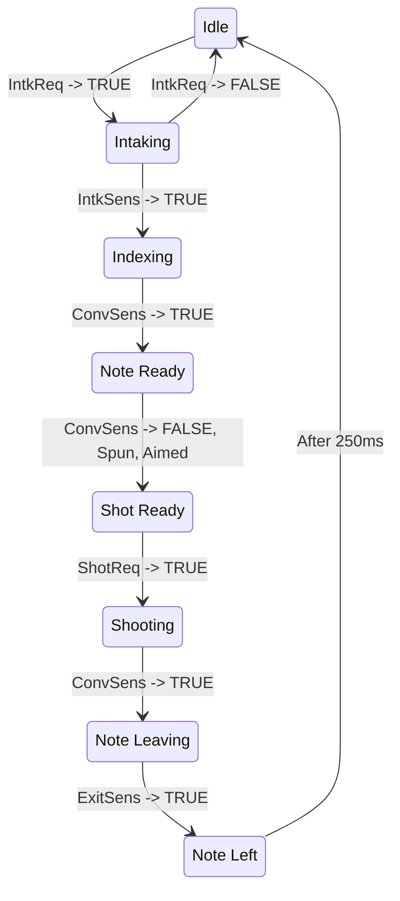

# Superstructure

## Subsystems

-   **Intake**
    -   Main Rollers - Kraken 1:1, gets NOTE from floor
    -   Secondary Roller - Neo 2:1, pulls NOTE from main rollers
-   **Conveyor**
    -   Rollers - Neo 4:1, pulls NOTE from Secondary Roller
    -   Can index to Conveyor Beam Break for consistent NOTE location
-   **Shooter**
    -   Independent Left/Right Wheels - Falcon 500, 2:1
    -   Right spins at 70% of left to induce spin when shooting in SPEAKER
-   **Aim**
    -   Arm, Falcon 500 ~312:1, aims shooter
    -   Can move over-center for AMP

## States

### State Diagram

This diagram is very basic and does not cover all state transition requirements.

### Output Truth Table

|    **State**     |  **Aim**  | **Intake** | **Conveyor** | **Shooter** |
| :--------------: | :-------: | :--------: | :----------: | :---------: |
|     **Idle**     | Hard stop |  Stopped   |   Stopped    |   Stopped   |
|   **Intaking**   | Hard stop |  Running   |   Running    |   Stopped   |
|   **Indexing**   | Hard stop |  Running   |   Running    |   Stopped   |
|  **Note Ready**  | Hard stop |  Stopped   |   Stopped    |   Stopped   |
|  **Shot Ready**  |   Aimed   |  Stopped   |   Stopped    |    Spun     |
|   **Shooting**   |   Aimed   |  Stopped   |   Running    |    Spun     |
| **Note Leaving** |   Aimed   |  Stopped   |   Running    |    Spun     |
|  **Note Left**   |   Aimed   |  Stopped   |   Stopped    |   Stopped   |

## Inputs

### Hardware

#### Discrete Signals (DIO)

-   Intake VisiSight (AsynchronousInterrupt from DIO)
    -   Watching for any edge change (note passage)
-   Shooter Conveyor Beam Break (SynchronousInterrupt from DIO)
    -   Watching for state change (`true/false` to denote note presence)
-   Shooter Exit Beam Break (SynchronousInterrupt from DIO)
    -   Watching for any edge change (note passage)

#### Numeric Signals (Motors/Encoders)

-   Left/Right Shooter RPS OK
    -   Tolerance based on target (Speaker/Amp)
-   Aim Angle Degrees OK
    -   Tolerance based on target (Speaker/Amp) and distance (near/far shot)

#### Control Signals (Human/Autonomous Requests)

-   Intake Request
    -   Shall be ignored when `state >= Indexing`
-   Prep Shot Request
    -   Shall be ignored when `state < Note Ready`
